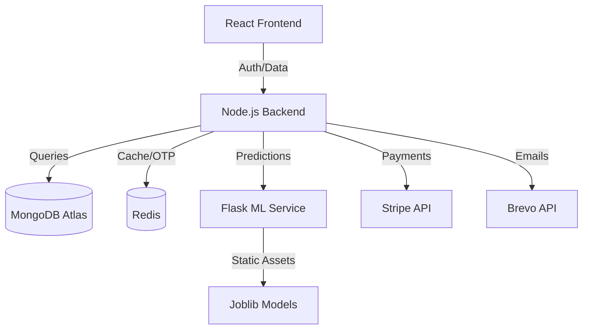

# CareSync – System Architecture

## High-Level Architecture
CareSync is designed as a hybrid ecosystem consisting of a Node.js/Express backend (REST API), a React frontend (SPA), and a Flask-based ML microservice.

## Role-Based Access Control (RBAC)
The system supports four distinct roles with strictly enforced boundaries:
- **Patient**: Owns medical records, manages access, books appointments.
- **Doctor**: Requests record access, treats patients, creates prescriptions.
- **Hospital Staff**: Manages appointments, handles check-ins, and billing.
- **Admin**: System governance, doctor approval, and reports.

## Core Workflows

### 1. Patient-Controlled Medical Access
Patients must explicitly grant access to Doctors. Doctors request access through their dashboard.
1. Doctor -> Request Access (`/doctor/access/request`)
2. Patient -> Receives Notification
3. Patient -> Approve Access (`/access/grant`)
4. Backend -> Store grant in Redis/MongoDB with expiry.

### 2. Billing & Stripe Lifecycle
1. Staff -> Create Bill (`/billing/create`)
2. Patient -> Pay via Frontend (Stripe Elements)
3. Stripe -> Webhook Notification
4. Backend -> Verify & Mark as Paid.

## Technology Justification
- **Node.js**: Scalable event-driven I/O for high-concurrency hospital requests.
- **Redis**: Low-latency storage for OTPs and caching computationally expensive ML results.
- **Flask**: Lightweight framework for exposing Python-based ML models without bloat.
- **MongoDB**: Schema-less flexibility for varying medical record formats.

## Security Considerations
- **JWT in HTTP-only Cookies**: Mitigates XSS attacks.
- **RBAC Middleware**: Ensures no horizontal/vertical privilege escalation.
- **Input Sanitization**: Global middleware to prevent NoSQL injection.
- **Stripe Webhooks**: Signature verification to prevent spoofing.
