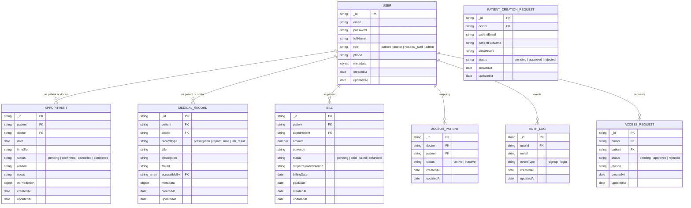

# Entity-Relationship Diagram (ERD)

This document represents the data model for the MediCare system using Mermaid.js syntax.

```mermaid
erDiagram
    USER ||--o{ APPOINTMENT : "as patient or doctor"
    USER ||--o{ MEDICAL_RECORD : "as patient or doctor"
    USER ||--o{ BILL : "as patient"
    USER ||--o{ DOCTOR_PATIENT : "mapping"
    USER ||--o{ AUTH_LOG : "events"
    USER ||--o{ ACCESS_REQUEST : "requests"
    
    USER {
        string _id PK
        string email
        string password
        string fullName
        string role "patient | doctor | hospital_staff | admin"
        string phone
        object metadata
        date createdAt
        date updatedAt
    }

    APPOINTMENT {
        string _id PK
        string patient FK
        string doctor FK
        date date
        string timeSlot
        string status "pending | confirmed | cancelled | completed"
        string reason
        string notes
        object mlPrediction
        date createdAt
        date updatedAt
    }

    MEDICAL_RECORD {
        string _id PK
        string patient FK
        string doctor FK
        string recordType "prescription | report | note | lab_result"
        string title
        string description
        string fileUrl
        string_array accessibleBy FK
        object metadata
        date createdAt
        date updatedAt
    }

    BILL {
        string _id PK
        string patient FK
        string appointment FK
        number amount
        string currency
        string status "pending | paid | failed | refunded"
        string stripePaymentIntentId
        date billingDate
        date paidDate
        date createdAt
        date updatedAt
    }

    DOCTOR_PATIENT {
        string _id PK
        string doctor FK
        string patient FK
        string status "active | inactive"
        date createdAt
        date updatedAt
    }

    ACCESS_REQUEST {
        string _id PK
        string doctor FK
        string patient FK
        string status "pending | approved | rejected"
        string reason
        date createdAt
        date updatedAt
    }

    AUTH_LOG {
        string _id PK
        string userId FK
        string email
        string eventType "signup | login"
        date createdAt
        date updatedAt
    }

    PATIENT_CREATION_REQUEST {
        string _id PK
        string doctor FK
        string patientEmail
        string patientFullName
        string initialNotes
        string status "pending | approved | rejected"
        date createdAt
        date updatedAt
    }
```
