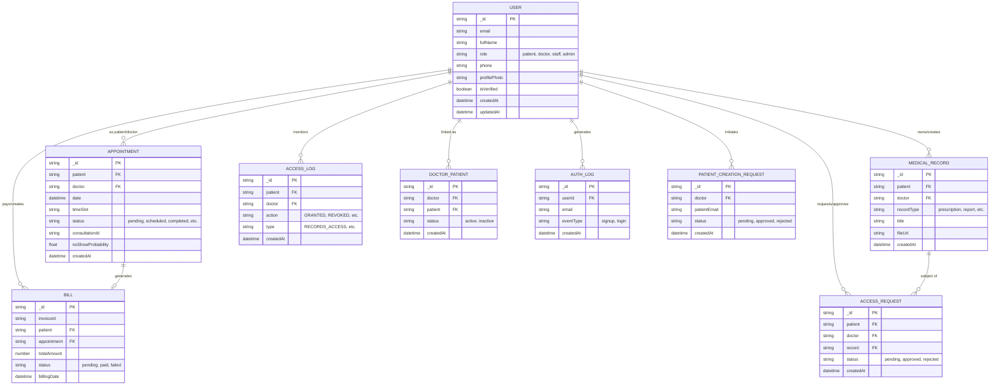

# CareSync – Enhanced ER Diagram

This document provides a high-fidelity Entity-Relationship Diagram (ERD) for the CareSync database, capturing all entities, their attributes, and relationships as defined in the Mongoose models.

## ER Diagram

## Entity Descriptions

### 1. USER
The core entity representing all system actors. The `role` field distinguishes between Patients, Doctors, Staff, and Admins.

### 2. APPOINTMENT
Tracks clinical encounters between Patients and Doctors. Includes metadata for virtual consultations (Jitsi/Twilio) and ML-driven "No-Show" predictions.

### 3. MEDICAL_RECORD
Stores sensitive clinical data. Access is governed by the **Privacy Shield**, requiring explicit patient consent.

### 4. BILL
Financial records generated from appointments, integrated with Stripe for secure payment processing.

### 5. ACCESS_LOG & ACCESS_REQUEST
Components of the privacy framework. `ACCESS_REQUEST` tracks pending permissions, while `ACCESS_LOG` provides an immutable audit trail of data access.

### 6. DOCTOR_PATIENT
A link table formalizing the professional relationship and data access permissions between a doctor and a patient.

### 7. AUTH_LOG
Security audit trail capturing user authentication events (signups/logins).

### 8. PATIENT_CREATION_REQUEST
Workflow entity for doctors to invite or initiate the onboarding of new patients.
