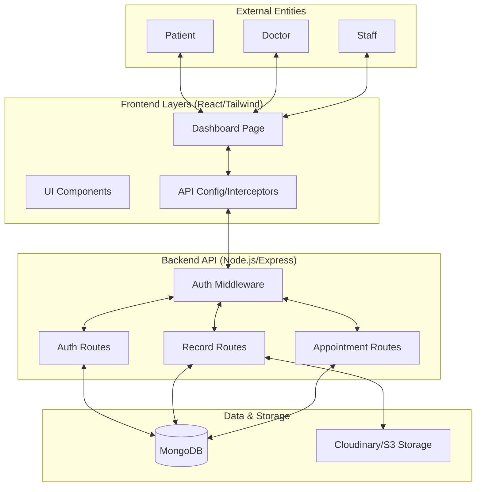

# High-Level Design (HLD)

## 1. System Overview
The MediCare 플랫폼 provides a decentralized, secure medical record management and appointment scheduling system. It bridges the gap between healthcare providers and patients through a unified, role-based dashboard.

## 2. High-Level Architecture

## 3. Major Components

| Component | Responsibility |
| :--- | :--- |
| **Identity Provider** | Handles signup, login, and JWT issuance with RBAC. |
| **Record Manager** | Manages medical documents, prescriptions, and access permissions. |
| **scheduler** | Facilitates appointment requests, confirmations, and no-show predictions. |
| **Permission engine** | Enforces data privacy so patients control who sees their clinical data. |

## 4. Key Workflows

### 4.1 Data Access Workflow
1. Doctor requests access via the Patient's Email.
2. Patient approves/denies the request on their dashboard.
3. Upon approval, a cryptographic link (DoctorPatient Model) is created.
4. The Doctor can now view and contribute to the Patient's records.

### 4.2 Security Protocol
- **At Rest**: Data is stored using standard MongoDB encryption at the host level.
- **In Transit**: All API communication is secured via HTTPS/TLS.
- **Application Level**: Sensitive operations are gated by a dual-check (`protect` + `authorize`).

## 5. Scalability Considerations
- **Stateless Backend**: The API is stateless, allowing for horizontal scaling behind a load balancer.
- **Read/Write Splitting**: (Future Scope) MongoDB replica sets for read performance.
- **Static Assets**: Frontend served via CDN for global low-latency.
