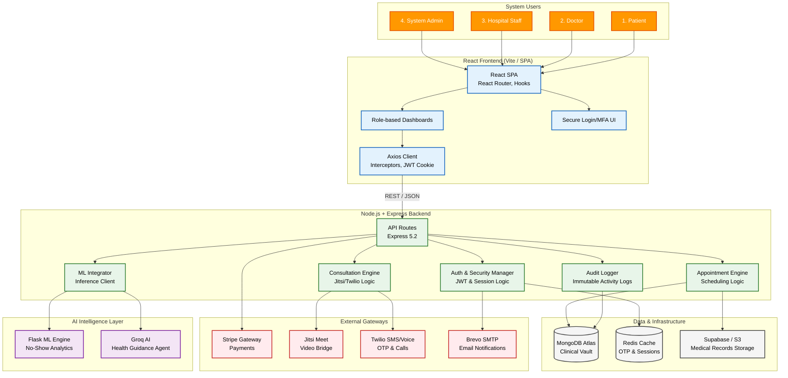
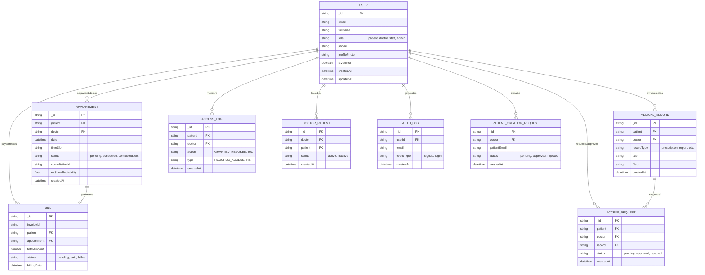
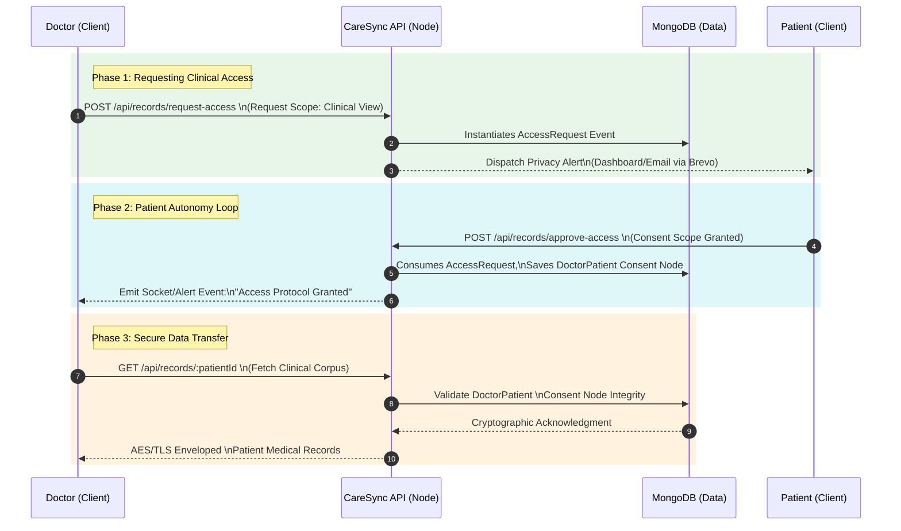
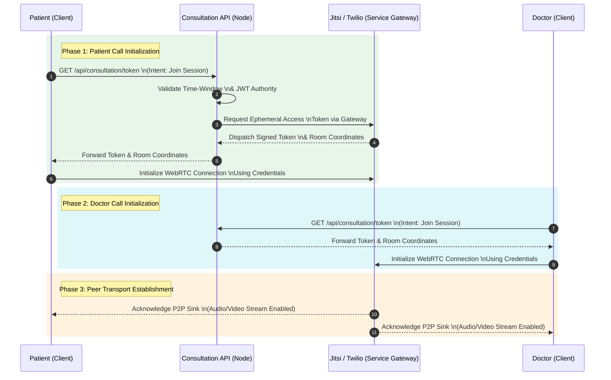

# High-Level Design (HLD): CareSync System

## 1. Executive Summary
CareSync is a state-of-the-art Hospital Management System (HMS) designed to bridge the gap between patient health ownership and professional medical management. Built upon a scalable MERN stack with microservices alignment, CareSync orchestrates complex clinical workflows, secure telehealth consultations, ML-driven predictions, and dynamic RBAC (Role-Based Access Control). At its core, it features a proprietary "Privacy Shield" enforcing explicit patient consent before clinical data access.

## 2. High-Level System Architecture

The architecture follows a decoupled, layered pattern integrating specialized microservices and external gateways to handle clinical operations smoothly.



## 3. Core Modules & Components

### 3.1 Authentication & Authorization Module (`authController.js`)
Handles secure login, signup, JWT generation, and password resets. Utilizes Redis for caching One-Time Passwords (OTPs) and enforcing rate limiting. Roles include `Patient`, `Doctor`, `Staff`, and `Admin`.

### 3.2 Medical Record Management (`recordController.js`)
Manages the "Clinical Vault" encompassing lab reports, biometric logs, and prescriptions. Bound tightly with the **Privacy Shield Protocol** to guarantee only authorized personnel can fetch or mutate records.

### 3.3 Telehealth & Consultation Engine (`consultationController.js`, `jitsiController.js`, `twilioController.js`)
Orchestrates virtual consultations. Generates secure Jitsi meeting links and Twilio connection tokens. Tracks call duration and limits access purely to scheduled time windows.

### 3.4 Appointment & Scheduling Orchestrator (`appointmentController.js`)
Manages doctor availability slots, handles bookings, and integrates with the `mlController.js` to assess patient "No-Show" probabilities.

### 3.5 Billing & Invoicing System (`billingController.js`)
Integrates directly with Stripe for processing consultation fees or hospital bills. Webhooks are implemented to handle asynchronous payment status updates firmly without clinical workflow disruption.

## 4. Database Schema Structure
The schema is housed in MongoDB, designed for quick NoSQL aggregations and linked references.

## 4. Database Schema Structure

The schema is housed in MongoDB, designed for clinical data integrity and strict access control.



## 5. Key Workflows

### 5.1 Privacy Shield (Access Delegation)
CareSync requires explicit authorization before sensitive clinical data is surfaced to a practitioner.



### 5.2 Teleconsultation Flow
Combines Jitsi for Video and Twilio for Voice, ensuring secure ephemeral connections.



## 6. Security & Data Protection
1. **Transport Layer:** Forceful HTTPS/TLS termination at the ingress level.
2. **Encryption at Rest:** Utilization of MongoDB Atlas standard AEAD encryption.
3. **Application Security:** 
   - Strict `helmet` implementation preventing Clickjacking and MIME sniffing.
   - Deep input sanitization to block NoSQL Injection vectors.
   - Comprehensive JWT signature verification with short expiration bursts.
4. **Auditability:** `AuthLog` collection captures granular login footprints, locations, and timestamps for anomalous behavioral detection.

## 7. Scalability Patterns
- **Stateless Backend Component:** Using JWTs removes session affinity requirements, letting Node.js containers auto-scale horizontally.
- **Microservices Alignment:** ML Predictions and Notifications are physically decoupled from the critical path of the Express monolith. 
- **Caching Layer:** Redis clusters reduce read-heavy latency spanning user dashboard loading (aggregations) and transient state features like unverified OTPs.

## 8. Structural Class Definitions (UML)

The following diagram illustrates the structural dependencies between React components, Express controllers, supporting services, and core data models.

```mermaid
classDiagram
    %% Styling Definitions
    class PatientDashboard "«Component»\nPatientDashboard"
    class DoctorDashboard "«Component»\nDoctorDashboard"
    class StaffDashboard "«Component»\nStaffDashboard"
    class AdminDashboard "«Component»\nAdminDashboard"

    class AuthController "«Controller»\nAuthController"
    class AppointmentController "«Controller»\nAppointmentController"
    class RecordController "«Controller»\nRecordController"
    class BillingController "«Controller»\nBillingController"

    class EmailService "«Service»\nEmailService"
    class MLService "«Service»\nMLService"
    class PdfGenerator "«Service»\nPdfGenerator"
    class StripeService "«Service»\nStripeService"

    class User "«Class»\nUser"
    class Appointment "«Class»\nAppointment"
    class MedicalRecord "«Class»\nMedicalRecord"
    class Bill "«Class»\nBill"

    %% Layer Colors
    style PatientDashboard fill:#FFF59D,stroke:#FBC02D
    style DoctorDashboard fill:#FFF59D,stroke:#FBC02D
    style StaffDashboard fill:#FFF59D,stroke:#FBC02D
    style AdminDashboard fill:#FFF59D,stroke:#FBC02D

    style AuthController fill:#BBDEFB,stroke:#1976D2
    style AppointmentController fill:#BBDEFB,stroke:#1976D2
    style RecordController fill:#BBDEFB,stroke:#1976D2
    style BillingController fill:#BBDEFB,stroke:#1976D2

    style EmailService fill:#C8E6C9,stroke:#388E3C
    style MLService fill:#C8E6C9,stroke:#388E3C
    style PdfGenerator fill:#C8E6C9,stroke:#388E3C
    style StripeService fill:#C8E6C9,stroke:#388E3C

    style User fill:#FFCDD2,stroke:#D32F2F
    style Appointment fill:#FFCDD2,stroke:#D32F2F
    style MedicalRecord fill:#FFCDD2,stroke:#D32F2F
    style Bill fill:#FFCDD2,stroke:#D32F2F

    %% Component Actions
    PatientDashboard --> AuthController : "logs in"
    PatientDashboard --> AppointmentController : "books"
    DoctorDashboard --> RecordController : "manages"
    StaffDashboard --> BillingController : "generates"

    %% Controller Logic
    AuthController ..> EmailService : "uses"
    AppointmentController ..> MLService : "predicts via"
    BillingController ..> StripeService : "processes"
    RecordController ..> PdfGenerator : "generates docs"

    %% Domain Relationships
    User "1" -- "*" Appointment : "owns"
    Appointment "1" -- "0..1" Bill : "triggers"
    User "1" -- "*" MedicalRecord : "has"
    User "1" -- "*" Bill : "responsible for"

    %% Methods & Props
    class AuthController {
        +login(credentials)
        +register(data)
        +logout()
        +requestSignupOTP(email)
    }

    class AppointmentController {
        +bookAppointment(data)
        +updateStatus(id, status)
        +getDoctorStats(id)
    }

    class User {
        +String email
        +String fullName
        +String role
        +Boolean isVerified
    }

    class Appointment {
        +Date date
        +String status
        +String timeSlot
    }
```
