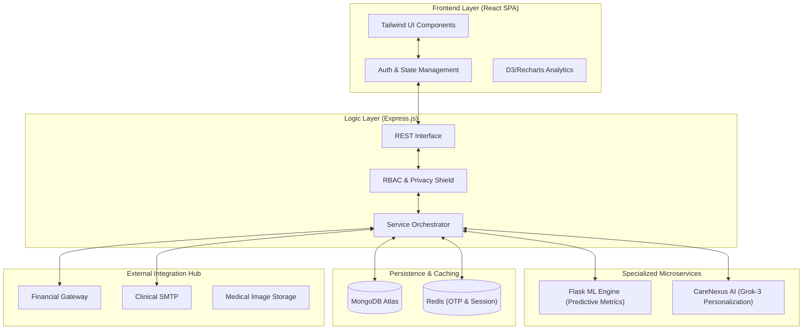
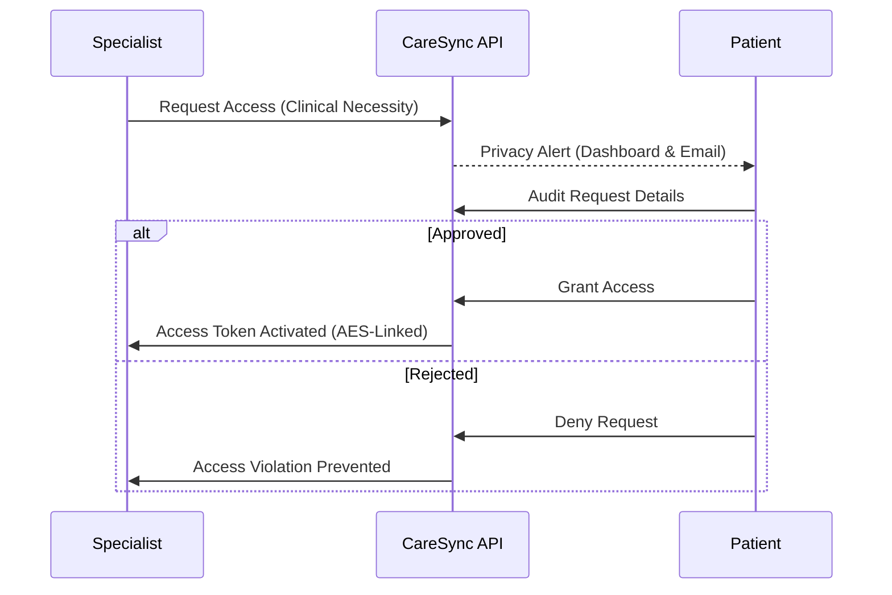

# 🏥 CareSync – High-Fidelity Healthcare Ecosystem

[](https://opensource.org/licenses/MIT)
[](https://nodejs.org/)
[](https://react.dev/)
[](https://www.mongodb.com/)
[](https://redis.io/)
[](https://stripe.com/)

CareSync is a state-of-the-art, production-ready Hospital Management System (HMS) that prioritizes **Patient Autonomy**, **Clinical Efficiency**, and **Enterprise-Grade Security**. Built on a microservices-aligned architecture, it bridges the gap between patient health ownership and professional medical management.

---

## 🏗️ Comprehensive Architecture

CareSync leverages a decoupled architecture to manage high-concurrency clinical operations and sensitive data processing.



---

## �️ The "Patient First" Logic (Clinical Privacy Shield)

CareSync implements a proprietary **Privacy Shield** protocol. Unlike legacy systems where hospital staff have blanket access, CareSync enforces **Explicit Patient Consent**.

### authorization Sequence


---

## 💻 Portal Ecosystem

CareSync provides four distinct, high-aesthetic dashboards tailored to specific user personas:

### 1. Patient Dashboard (Health Autonomy)
- **CareNexus AI Assistant**: Personalized health insights powered by Grok, aware of your latest vitals.
- **Privacy Shield Control**: Monitor every access attempt and revoke clinician access instantly.
- **Biometric Logs**: Real-time sync of Weight, BP, and Height directly from clinician updates.
- **Clinical Vault**: Consolidated view of prescriptions, lab reports, and imaging.

### 2. Physician Portal (Clinical Precision)
- **Authorized Patient View**: Deep-dive into records for patients who granted access.
- **Clinical Collaboration**: Share complex cases with authorized peers for second opinions.
- **Appointment Management**: Adaptive scheduling with AI-driven "No-Show" probability metrics.
- **Biometric Update**: Directly update patient vitals during consultations.

### 3. Hospital Staff Portal (Operational Efficiency)
- **Patient Onboarding**: Secure invitation system for new clinical entities.
- **Billing & Triage**: Automated invoice generation via Stripe with tax calculation.
- **Inventory Sync**: (Roadmap) Tracking clinical hardware and pharmaceutical stock.

### 4. Administrative Hub (System Governance)
- **Identity Management**: Enterprise control over system users and role rotations.
- **Clinical Analytics**: Aggregated hospital performance metrics (Revenue, Patient Throughput).
- **Security Audit Logs**: Real-time monitoring of sensitive data access attempts.

---

## 🛠️ Technical Deep Dive

### The Stack Rationale
- **Node.js/Express**: Non-blocking I/O for handling hundreds of concurrent appointment syncs.
- **Redis**: Mission-critical for OTP storage (login security) and caching ML predictions to reduce latency.
- **Flask (ML Service)**: Handles scikit-learn models for predicting patient medication adherence.
- **Stripe**: Handles the entire PCI-compliance load; CareSync never touches raw card data.

### Security Implementation
- **Sanitization**: `express-mongo-sanitize` and `xss-clean` for deep parameter scrubbing.
- **Rate Limiting**: Custom windowing to prevent brute-force on sensitive clinical entry points.
- **Session Security**: JWTs stored in `HttpOnly`, `Secure` cookies with `SameSite=Strict`.

---

## 🚀 Deployment & Bootstrap

### Prerequisite Environment Variables
Create a `.env` in `backend/` with:
```bash
PORT=5000
MONGODB_URI=your_mongodb_atlas_uri
JWT_SECRET=high_entropy_secret
GROQ_API_KEY=xAI_access_key
BREVO_API_KEY=email_gateway_key
STRIPE_SECRET_KEY=billing_key
REDIS_URL=redis_connection_string
```

### Rapid Orchestration (Docker)
```bash
docker-compose up --build
```

### Manual Installation
1. **Backend**: `cd backend && npm install && npm run dev`
2. **Frontend**: `cd frontend && npm install && npm run dev`
3. **ML Core**: `cd ml-service && pip install -r requirements.txt && python app.py`

---

## � Future Roadmap (V4.x)
- [ ] **DICOM Viewer Integration**: Native viewing of MRI/CT scans in-browser.
- [ ] **Blockchain Audit**: Decentralized clinical access logs for immutable transparency.
- [ ] **Telehealth 2.0**: Integrated WebRTC for secure high-definition clinical video sync.

---
<p align="center">
  <b>CareSync</b> – Engineered by Innovators for the Future of Care.<br>
  <i>"Where Privacy Meets Precision."</i>
</p>
