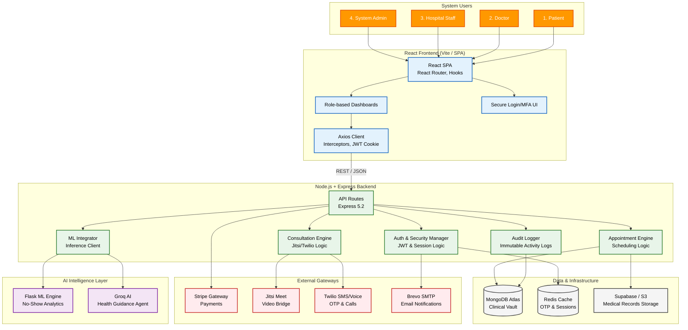

# CareSync – Revamped System Architecture

This document provides a detailed visual representation of the CareSync System Architecture, following a layered microservices pattern.

## System Architecture Diagram

## Layer Descriptions

### 1. User Layer
Defines the primary actors interacting with the system: Admins, Hospital Staff, Doctors, and Patients.

### 2. Frontend Layer
Built with React and Vite, utilizing Axios for secure communication and JWT-based session handling via cookies.

### 3. Backend Layer
A Node.js/Express monolith orchestrating core clinical workflows, authentication middleware, and integration with specialized services.

### 4. External Gateways
Integration points for third-party services: Stripe (Payments), Jitsi (Video), Twilio (SMS/Voice), and Brevo (Email).

### 5. Data & Infrastructure
- **MongoDB Atlas**: Primary storage for medical records and user data.
- **Redis Cache**: High-speed storage for OTPs and transient session data.
- **Object Storage (S3/Supabase)**: Scalable storage for medical images and reports.

### 6. AI Intelligence Layer
- **Flask ML Engine**: Handles predictive analytics (e.g., No-Show probabilities).
- **Groq AI**: Provides intelligent guidance and health-related assistance.
