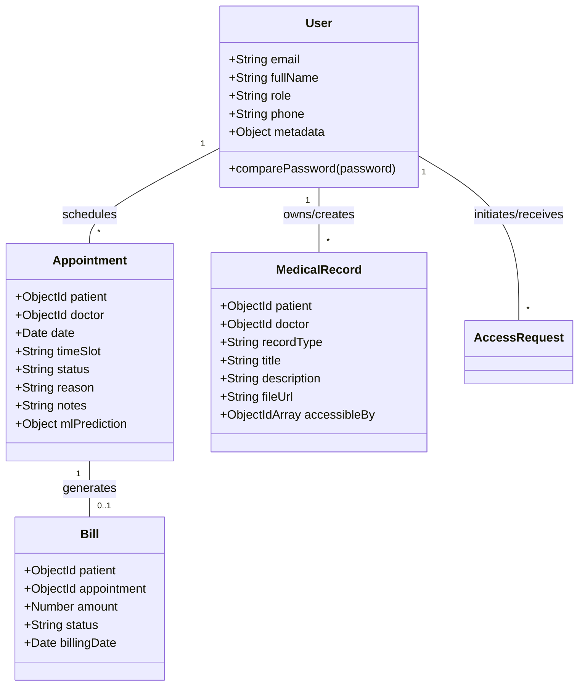
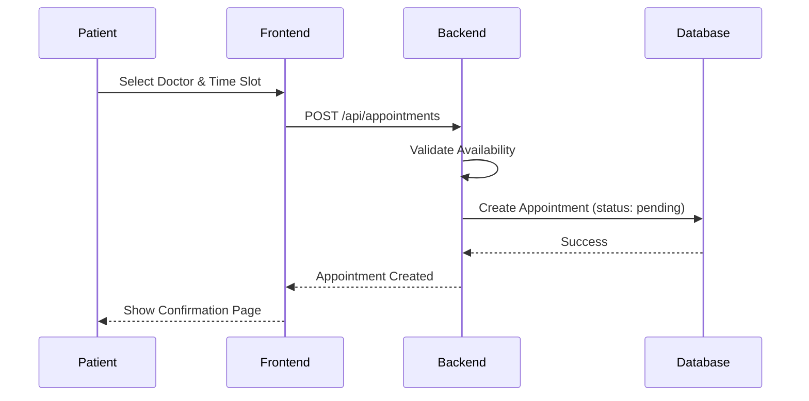
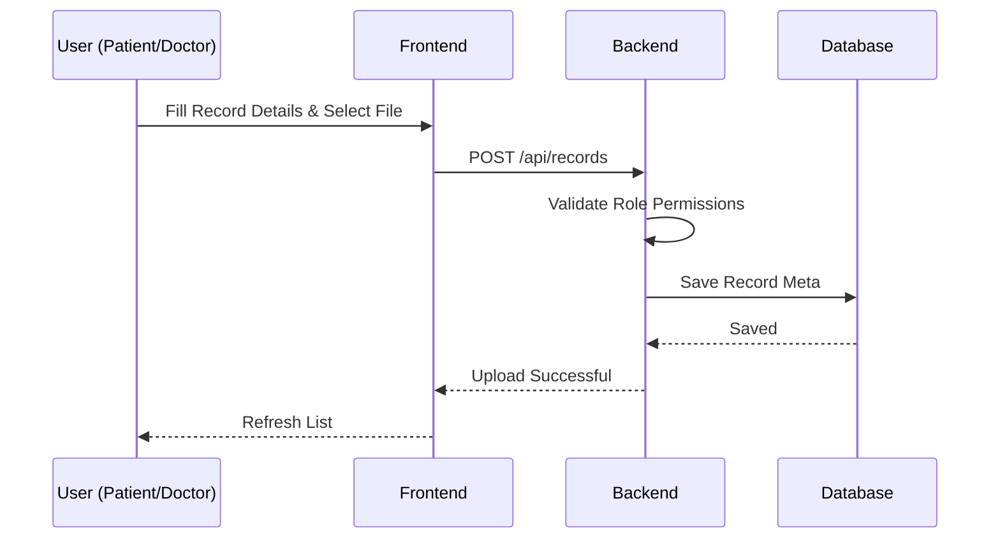

# Unified Modeling Language (UML) Diagrams

This document contains Class and Sequence diagrams for the MediCare system.

## Class Diagram

## Sequence Diagram: Appointment Booking Flow

## Sequence Diagram: Medical Record Upload Flow

